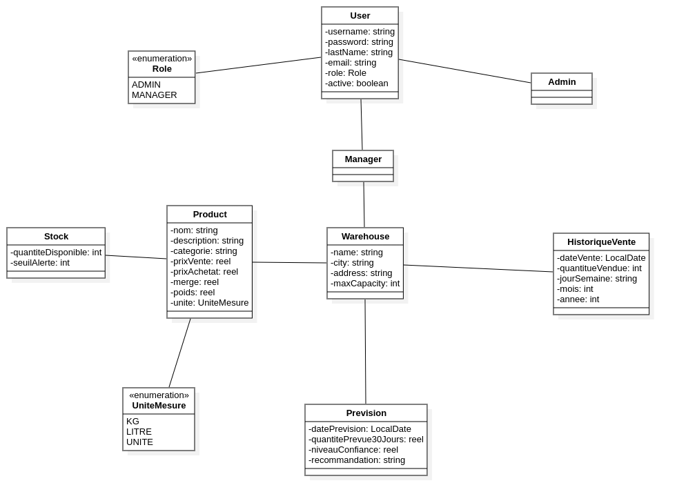
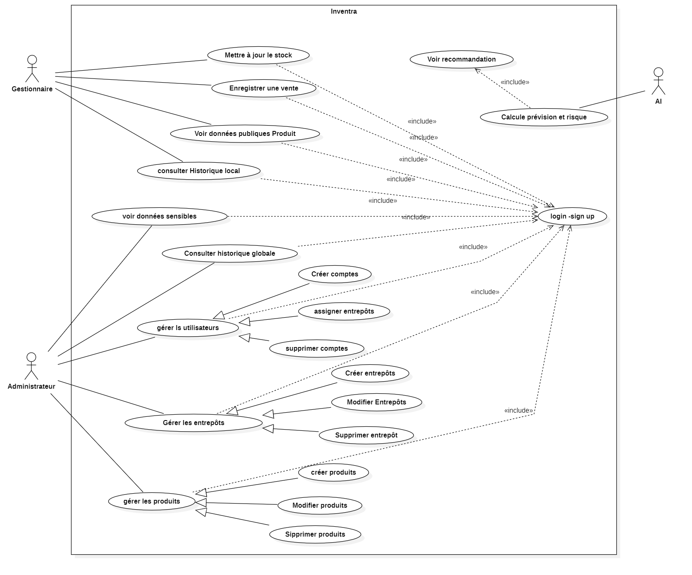

# Inventra

> Intelligent Multi-Warehouse Stock Forecasting and Secure Management System

Inventra is a robust Spring Boot application designed to manage multi-warehouse stock with advanced forecasting capabilities and secure access management.

## Class Diagram



## Use Case Diagram



## Technologies Used

- **Java 21**: Core programming language.
- **Spring Boot 3.5.9**: Framework for building the application.
- **Spring Data JPA**: For database interactions.
- **Spring Security**: For authentication and authorization (JWT).
- **Spring AI**: Integration with Google GenAI for intelligent features.
- **PostgreSQL**: Primary database.
- **Docker & Docker Compose**: For containerization and orchestration.
- **MapStruct**: For efficient object mapping.
- **Lombok**: to reduce boilerplate code.
- **Swagger / OpenAPI**: For API documentation.
- **Jacoco & SonarQube**: For code quality and coverage.

## Getting Started

### Prerequisites

- Java 21 SDK
- Maven
- Docker & Docker Compose

### Configuration

1.  Clone the repository.
2.  Duplicate `.env.example` to `.env` and configure your environment variables (Database, API keys, etc.).

    ```bash
    cp .env.example .env
    ```

## Running the Application

### Using Docker Compose

The easiest way to run the application and its dependencies (PostgreSQL, etc.) is using Docker Compose.

```bash
docker-compose up -d --build
```

### Manual Run

If you prefer to run the application locally with a local PostgreSQL instance:

1.  Ensure your PostgreSQL database is running and configured in `.env`.
2.  Run the application using Maven:

    ```bash
    ./mvnw spring-boot:run
    ```

## API Documentation

Once the application is running, you can access the Swagger UI documentation at:

```
http://localhost:8080/swagger-ui/index.html
```
